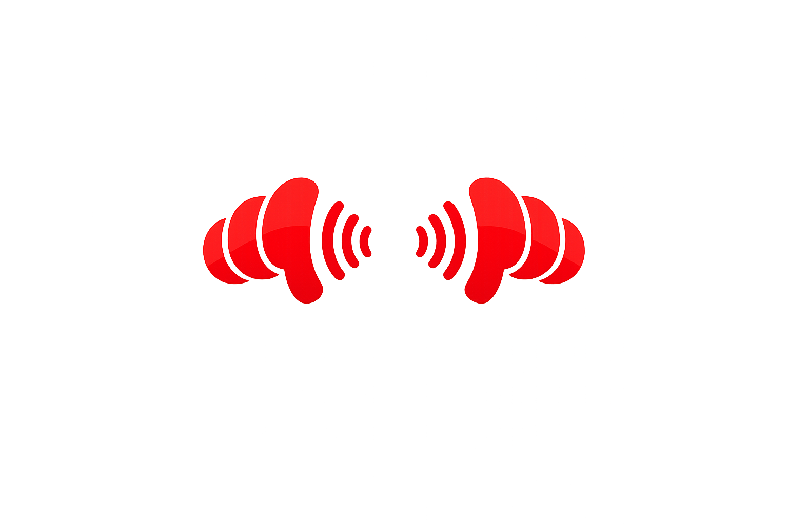

<p align="center">
  
</p>

<h1 align="center">Pairio</h1>

<p align="center">
  <strong>AirPods Audio Sharing for Mac</strong><br>
  Share audio with multiple AirPods simultaneously, just like iPhone and Apple TV.
</p>

<p align="center">
  
  
  
</p>

## What is Pairio?

Pairio is a menu bar app that enables audio sharing on Mac. Connect multiple AirPods and listen together – perfect for watching movies, listening to music, or sharing content with friends.

## Requirements

- **macOS 26 (Tahoe)** or later
- **Xcode 16+** (for building from source)
- Any Bluetooth audio device

## Installation

### Homebrew (Recommended)

```bash
brew install ixmxvii-hash/pairio/pairio
```

Or tap first:

```bash
brew tap ixmxvii-hash/pairio
brew install pairio
```

### One-liner Script

```bash
curl -fsSL https://raw.githubusercontent.com/ixmxvii-hash/Pairio/main/scripts/install.sh | bash
```

### Manual Install

```bash
git clone https://github.com/ixmxvii-hash/Pairio.git
cd Pairio
make install
```

### Uninstall

```bash
# If installed via Homebrew
brew uninstall pairio

# If installed manually
make uninstall
```

Or just delete Pairio from your Applications folder.

## Usage

1. **Launch Pairio** from Applications or Spotlight
2. Look for the **headphone icon** in your menu bar
3. Connect your AirPods to your Mac (via Bluetooth settings)
4. Click the Pairio icon to see connected audio devices
5. Select multiple AirPods to share audio

## How It Works

Pairio uses macOS's CoreAudio framework to create a **Multi-Output Aggregate Device**. This virtual device combines multiple audio outputs, allowing synchronized playback to all selected devices.

## Building from Source

```bash
# Clone
git clone https://github.com/ixmxvii-hash/Pairio.git
cd Pairio

# Build only
make build

# Build and install to /Applications
make install

# Clean build artifacts
make clean
```

## Why Build from Source?

Building locally means macOS trusts the app since it was built on your machine. This avoids:
- Gatekeeper warnings about unsigned apps
- "App can't be opened" security dialogs
- The need for expensive Apple Developer certificates

## Contributing

Contributions welcome! Please feel free to submit issues and pull requests.

## License

MIT License – see [LICENSE](LICENSE) for details.

## Acknowledgments

- Inspired by Apple's audio sharing feature on iPhone and Apple TV
- Built with SwiftUI and CoreAudio
